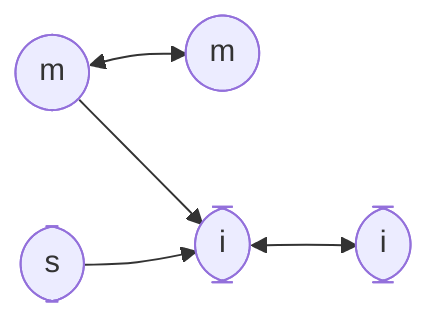
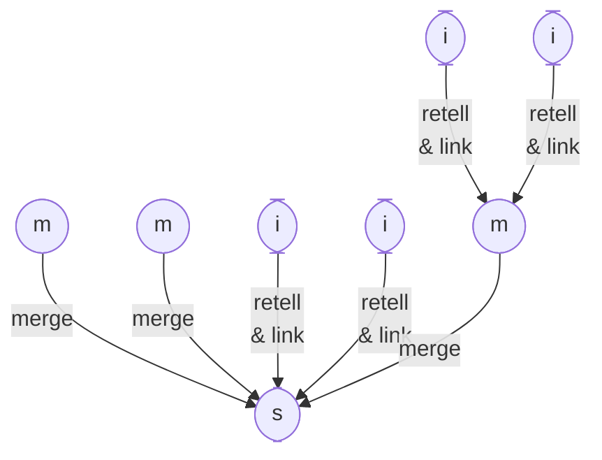

#notes #image

# Типы заметок

* **import**
	* цитаты и конспект источников
		* разделяю цитаты на части и присваиваю заголовки
		* выделяю ключевые места
		* иногда пересказываю их в начале заметки в виде списка
		* иногда рисую схему [^1]
	* делаю по одной заметке на источник
	* ссылаюсь на всю заметку или заголовки
* **my (без тега)**
	* мои мысли (+ пересказ источников)
	* по мере роста может превратиться в черновик текста
* **summary (sum)**
	* черновик текста
* **export**
	* оформленный черновик

# Как писать тексты на основе заметок

* собирать материал
	* записывать все по теме в один файл по мере обработки источников
	* объединять уже написанные заметки
* обрабатывать
	* группировать пункты
	* присваивать заголовки
	* выстраивать в нужном порядке
	* подгонять, чтобы складывалось в единое повествование

# Ссылки

# Обобщение

[^1]: [Как рисовать Mermaid](2022-1019-1050.Как%20рисовать%20Mermaid.md)  