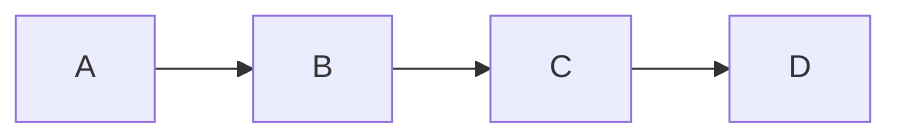
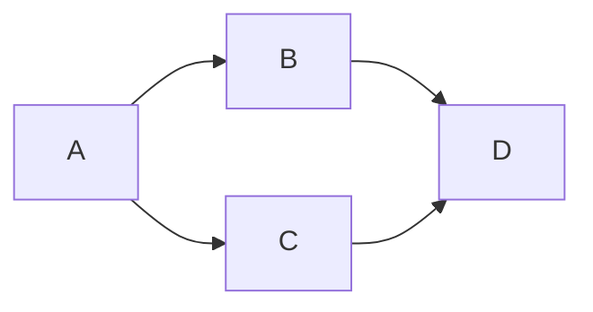
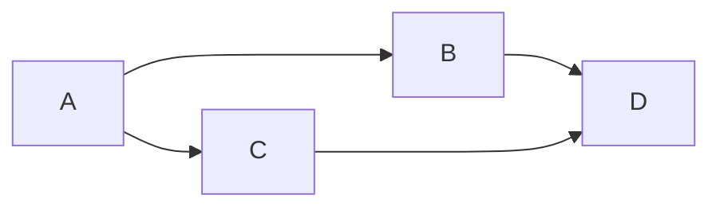
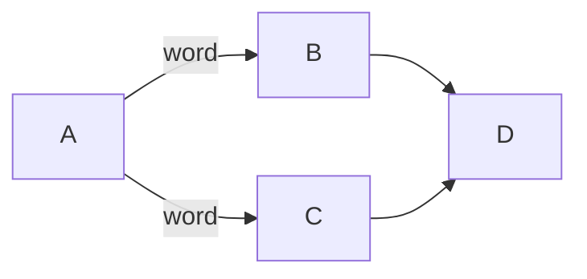
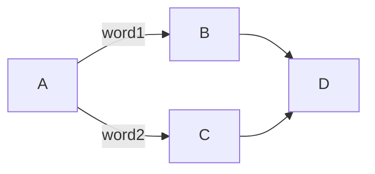
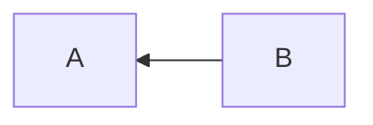
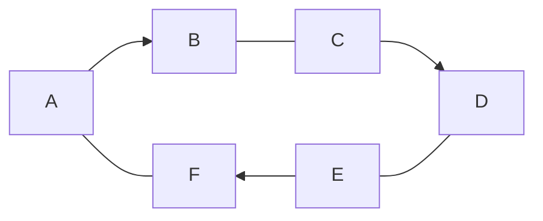
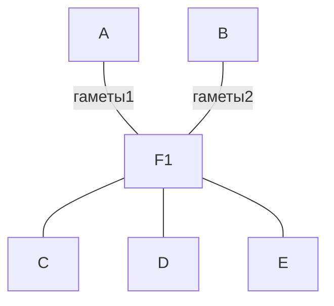

#notes #genetics #image

Несколько элементов подряд

Связь один ко многим и многие к одному

Стрелка в обратную сторону

Направление по кругу

Связь многие ко многим через дополнительный узел в генеалогическом дереве или генетической задаче

