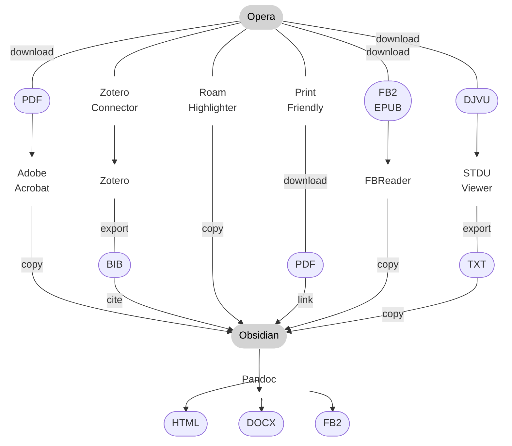

#notes #image 

* **Компьютер**
	* Opera (закладки) [^1]
		* Roam Highlighter (копирование цитаты веб-страниц)
		* ~~Obsidian Web (сохранение цитаты веб-страниц в Обсидиан)~~
		* PrintFriendly (сохранение веб-страниц в PDF)
		* ~~BibItNow (библиографические данные веб-страниц)~~ [^2]
		* Zotero Connector
	* Adobe Acrobat (просмотр PDF, распознавание текста)
	* STDU Viewer (экспорт цитат из DJVU)
	* FBReader (чтение FBI, EPUB)
	* Obsidian (заметки) [^3] [^4] [^5] [^6]
	* Notepad++ (массовая автозамена)
	* VSCode (массовая автозамена, визуальное редактирование диаграмм)
	* ~~JabRef (данные источников)~~ [^2]
	* Zotero (данные источников)
	* Pandoc (экспорт в HTML и DOCX) [^7] [^8]
* **Мобильный**
	* ~~Epsilon Notes (маркдаун-редактор)~~
		* ~~компактный интерфейс~~
		* ~~предпросмотр заметок~~
		* ~~быстрая фильтрация по названию~~ [^5]
	* Markor (маркдаун-редактор)
		* показывает mermaid и latex
		* не поддерживает выделение == и ссылки на заголовки
	* ReadEra (экспорт цитат из PDF и DJVU)
	* ~~UPX (для ютуба)~~
	* Kiwi Browser
		* поддерживает расширения
	* MindLine
		* наброски схем
* **Синхронизация** [^9]
	* Syncthing/Synctrazor
* **Версии файлов**
	* ~~Dropbox~~
	* Mega
* **Сервисы**
	* ~~Mermaid Live Editor (сохранение диаграмм в SVG и PNG)~~
	* Mermaid Chart (визуальный редактор и экспорт)
	* Visual CSL Editor (оформление списка источников)
	* ~~Youtube4kdownloader (скачать видео с ютуба)~~
	* Y2meta (скачать видео с ютуба)
	* Downsub (скачать субтитры с ютуба)

[^1]: [Mhtml в Опере](2019-1101-0000.Opera.md)  
[^2]: [Источники](2022-0110-0052.Источники.md)  
[^3]: [Notes](2021-1228-1435.Notes.md)  
[^4]: [Заметки](2021-1105-2320.Заметки.md)  
[^5]: [Названия](2022-1019-1354.Названия.md)  
[^6]: [Лайфхаки](2022-1019-1437.Лайфхаки.md)  
[^7]: [Подготовка к экспорту](2022-1019-1118.Подготовка%20к%20экспорту.md)  
[^8]: [Экспорт](2022-0110-0052.Экспорт.md)  
[^9]: [Сбор заметок](2022-1108-1706.Сбор%20заметок.md)  