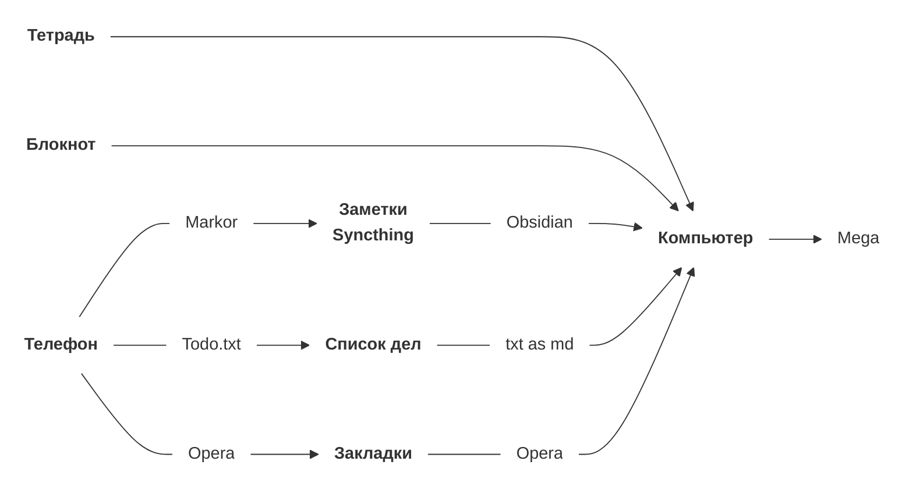

#notes #image

```mermaid
flowchart LR


ТТ("Тетрадь")
БЛ("Блокнот")

ТЛ("Телефон")
MR("Markor")
DR("Mega")
SN("Заметки\n Syncthing")
OB("Obsidian")
ST("Todo.txt")
СД("Список дел")
TXT("txt as md")
OP1("Opera")
ЗК("Закладки")
OP2("Opera")

КМ("Компьютер")

ТТ & БЛ -----> КМ --> DR
ТЛ --- MR --> SN --- OB --> КМ
ТЛ --- ST --> СД --- TXT --> КМ
ТЛ --- OP1 --> ЗК --- OP2 --> КМ

class ДМ,ТТ,ТЛ,DN,MR,DR,SN,OB,ST,СД,TXT,OP1,ЗК,OP2,ВДМ,БЛ,КМ HIDE
classDef HIDE fill:none,stroke:none

class ТТ,БЛ,ТЛ,SN,СД,ЗК,КМ BOLD
classDef BOLD stroke-width:3px,font-weight:bold
```