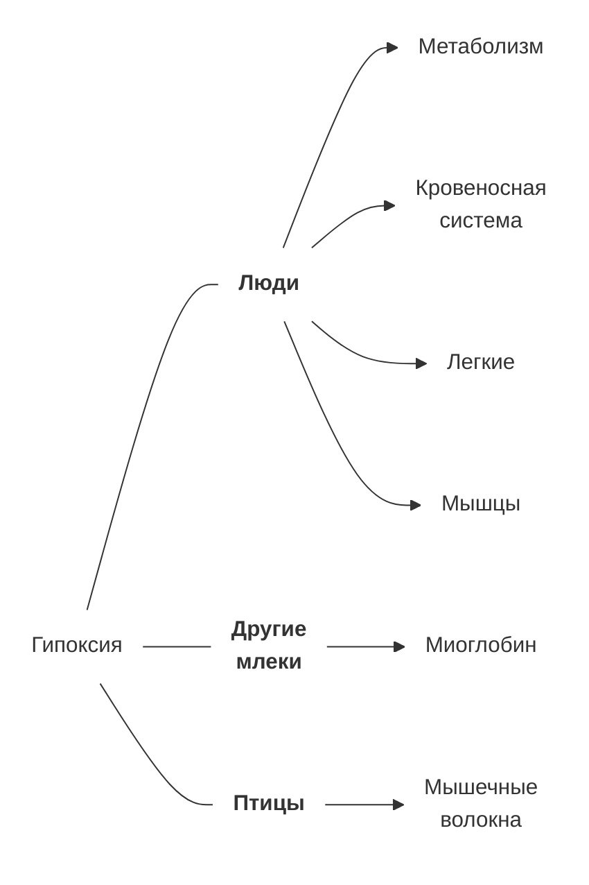
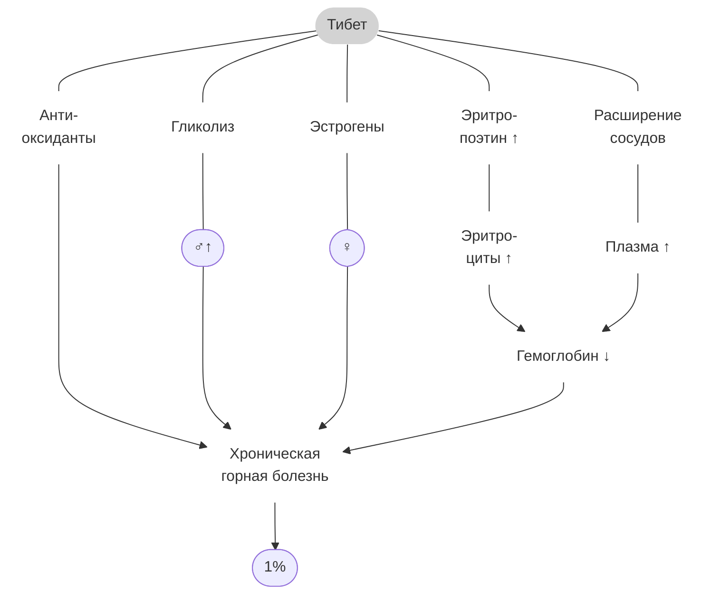
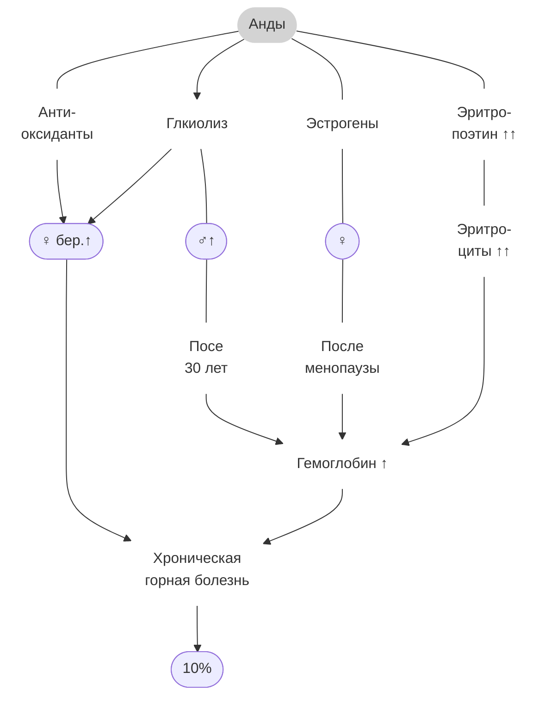
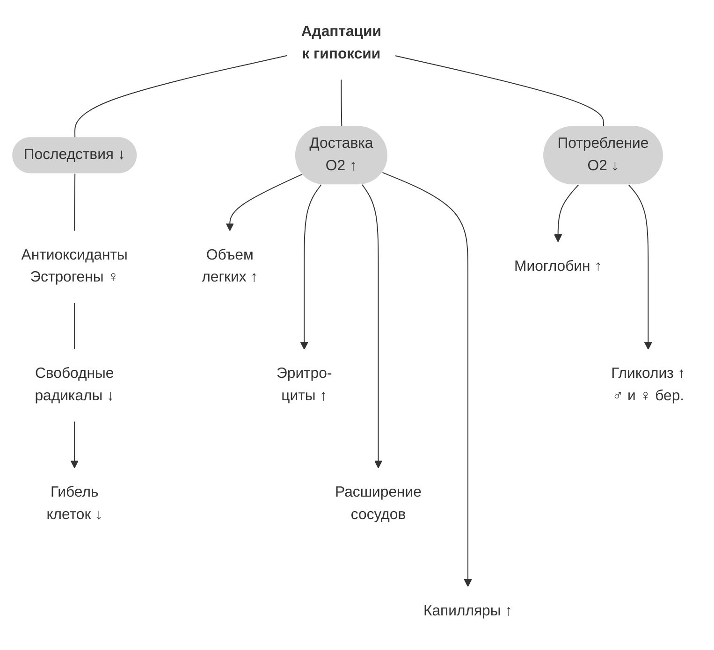

#biology #metabolism #blood #breathing #muscles #mountain #image #video

# Разные виды

* **Люди**
	* Метаболизм
		* меньше митохондрий [^1]
		* активнее гликолиз [^2] [^3]
	* Кровеносная система
	* Больше легкие [^4] [^5]
	* Больше мышц [^4]
		* миоглобин при сдавленных травмах [^6]
* **Другие млекопитающие**
	* Миоглобин в мышцах
		* ехидна [^7]
		* тюлень Уэддела [^8] [^9]
* **Птицы**
	* Больше медленных мышечных волокон [^10]
		* повышают выносливость



# Тибет и Анды

* **Люди на Тибете**
	* Больше крови, эритроцитов и плазмы ⇒ стабильный уровень гемоглобина [^11] [^12]
	* Расширение сосудов ⇒ больше приток крови и объем плазмы [^12] [^13] [^14]
	* Гуще сеть капилляров [^15]
* **Люди в Андах**
	* Больше крови и эритроцитов ⇒ высокий уровень гемоглобина [^12]
	* Больше правый желудочек, который направляет венозную кровь к легким [^16]

```mermaid
flowchart LR

КР("Кровеносная\n система")
КП("Плазма\n Сосуды\n Капилляры")
ЭР("Эритроциты\n Объем крови")
СР("Сердце")

ТБ(["Тибет"])
АНТ(["Анды"])
РЖ(["1%"])
ЧЩ(["10%"])
ХР("Хроническая\n горная болезнь")

ТБ --- РЖ --> ХР 
АНТ --- ЧЩ --> ХР

КР --- КП --> ТБ
КР --- ЭР --> ТБ & АНТ
КР --- СР --> АНТ

linkStyle 0,1,2,3 fill:none,stroke-dasharray:3 3

class КР,КП,ЭР,СР,ТБ,АНТ,ХР HIDE
classDef HIDE fill:none,stroke:none

class КР,ТБ,АНТ BOLD
classDef BOLD font-weight:bold
```

* Объем крови у жителей Тибета и Анд сопоставим и больше, чем у жителей равнин, максимум в 1,5 раза. [^12]
	* У тибетцев больше эритроцитов, чем у жителей равнин, но меньше, чем у жителей Анд, зато больше плазмы. [^12]
* При этом избыточное производство эритроцитов повышает вязкость крови, что приводит к хронической горной болезни. [^17]
	* Тибетцы страдают от нее в десять раз реже, [^18] возможно, из-за меньшего уровня гемоглобина.
	* Если у тибетцев и эфиопов схожий уровень гемоглобина, [^18] то эфиопы тоже редко от нее страдают?
* Концентрация гемоглобина наследуется у жителей Тибета и Анд. [WEB](https://pubmed.ncbi.nlm.nih.gov/21672719/)
	* Тибетцы редко страдают от острой горной болезни даже после нескольких лет на равнине. [WEB](https://pubmed.ncbi.nlm.nih.gov/28698346/)
	* У них также меньше митохондрий, даже если они выросли и жили на равнине, что может указывать на наследование признака. [^1]
	* У части эфиопов тоже нормальный уровень гемоглобина и выше уровень оксида азота. [WEB](https://pubmed.ncbi.nlm.nih.gov/35463974/)
	* Высокое содержание оксида азота подавляет реакцию на гипоксию. [WEB](https://pubmed.ncbi.nlm.nih.gov/31912870/)

# Мужчины и женщины

* Женщины народов Анд вне беременности потребляют меньше глюкозы, чем мужчины, [^2] и реже страдают хронической горной болезнью, [^5] а если страдают, то после менопаузы. [^18]
	* После акклиматизации женщины в горах тоже потребляют меньше глюкозы, чем мужчины, [^2] то есть компенсация гипоксии за счет гликолиза у них менее выражена.
	* Дело может быть в мышцах, которые требуют меньше кислорода, более медленном обмене веществ, а также в половых гормонах, которые защищают от гипоксии.
* При гипоксии образуются свободные радикалы, [^19] поэтому у тибетцев больше антиоксидантов, чем у жителей равнин после акклиматизации. [^2]
	* Эстрогены же защищают от свободных радикалов в 2,5 раза лучше, чем витамины, и тем самым предотвращают апоптоз клеток, в том числе печени. [^19]
	* В волосяных фолликулах они также способствуют росту сосудов. [^20]
* Таким образом, эстрогены защищают клетки от гипоксии, поэтому у женщин механизмы ее компенсации менее выражены?
	* Однако, у жителей Тибета не отмечены различия по полу в развитии хронической горной болезни, а значит у них эстрогены играют меньшую роль в компенсации гипоксии, чем у жителей Анд?
	* У беременных женщин в Андах повышается не только потребление глюкозы, но и антиоксиданты.
* У мужчин в Андах после тридцати может снижаться гликолиз, а у женщин после менопаузы - уровень эстрогенов, что повышает вероятность хронической горной болезни, а значит эти механизмы могут играть схожую роль.
	* Когда гликолиз и эстрогены перестают защищать от гипоксии, может расти число эритроцитов, чтобы компенсировать недостаток кислорода, что может вызвать хроническую горную болезнь.
	* Если же у тибетцев такого не происходит, то у них ведущую роль в защите от гипоксии играет что-то еще.
	* Вероятно, антиоксиданты, расширенные сосуды и ограниченный рост эритроцитов из-за более низкого эритропоэтина, чем у жителей Анд. [^1]

|                                | Акклим. | Тибет        | Анды                                               | Эфиопия |
|:------------------------------ |:------- |:------------ |:-------------------------------------------------- |:------- |
| Хроническая<br>горная болезнь  |         | 1%           | 10%<br>==♂ > ♀==<br>==♂ 30+==<br>==♀ > менопауза== |         |
| Митохондрии                    | ↓       | ↓ насл?      | ↓                                                  |         |
| Потребление<br>глюкозы (PPARA) | ==♂↑==  | ==♂↑== насл? | ==♂↑ ♀бер.↑==                                      |         |
| Антиоксиданты (PPARA)          |         | ↑ насл?      | ==♀бер.↑==                                         |         |
| Объем крови                    |         | ↑1,5         | ↑1,5                                               |         |
| Масса эритроцитов              |         | ↑            | ↑↑                                                 |         |
| Уровень<br>гемоглобина         |         | === насл.    | ↑ насл.                                            | ===     |
| Оксид азота                    |         | ↑            |                                                    | ↑       |
| Объем плазмы                   |         | ↑↑           | ↑                                                  |         |





# Выводы

* Таким образом, адаптации к гипоксии предполагают:
	* устранение последствий
		* антиоксиданты, в том числе женские половые гормоны, обезвреживают свободные радикалы и предотвращают гибель клеток
	* улучшение доставки кислорода
		* больше объем легких
		* больше эритроцитов
		* расширение сосудов
		* больше капилляров
	* снижение потребления кислорода
		* запасание кислорода в миоглобине
		* усиление гликолиза



[^1]: [Beall_2007](2023-0918-1508.Beall_2007.md#Mitochondria)  
[^2]: [Moore_2017](2023-0922-1013.Moore_2017.md#Mitochondria)  
[^3]: [Moore_2017](2023-0922-1013.Moore_2017.md#Genes)  
[^4]: [Адаптивные типы человека](2023-0530-1523.Адаптивные%20типы%20человека.md)  
[^5]: [Эшкрофт_2016](2024-0705-1602.Эшкрофт_2016.md#Mountain)  
[^6]: [Миоглобин](2023-0224-0048.Миоглобин.md)  
[^7]: Носова. [WEB](https://youtu.be/Fr_L4152sQI#t=259,322), [MP4](file:///D:/Остальное/Biology/Video/Ехидна.mp4#t=259,322)  
[^8]: [Сомеро_1988](2023-1230-1804.Сомеро_1988.md#Myoglobin)  
[^9]: [Эшкрофт_2016](2024-0705-1602.Эшкрофт_2016.md#Water)  
[^10]: [Chaillou_2018](2023-0416-2200.Chaillou_2018.md)  
[^11]: [Huerta_Sanchez_2014](2023-0429-1231.Huerta_Sanchez_2014.md)  
[^12]: [Stembridge_2019](2023-0912-1558.Stembridge_2019.md)  
[^13]: [Erzurum_2007](2023-0429-1132.Erzurum_2007.md)  
[^14]: [Beall_2007](2023-0918-1508.Beall_2007.md#Blood%20flow)  
[^15]: [Beall_2007](2023-0918-1508.Beall_2007.md#Capillars)  
[^16]: [Lindo_2018](2023-0912-1705.Lindo_2018.md)  
[^17]: [Hainsworth_2007](2023-0926-0928.Hainsworth_2007.md)  
[^18]: [Moore_2017](2023-0922-1013.Moore_2017.md#CMS)  
[^19]: [Lee_2008](2024-0717-1218.Lee_2008.md)  
[^20]: [Алопеция](2023-0906-1651.Алопеция.md)  