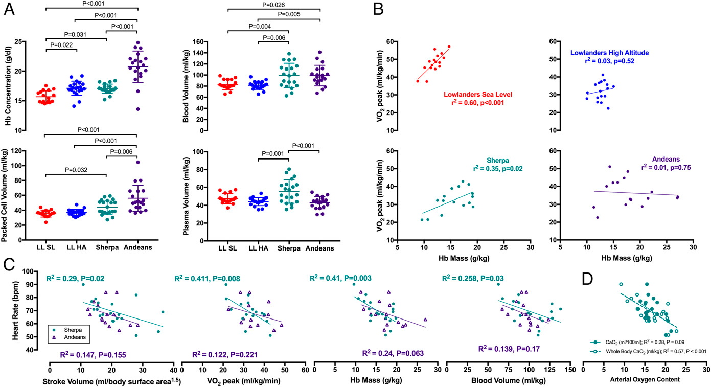

#import #biology #humans #blood #mountain #tibet #andes #image

* In contrast to Andean natives, high-altitude ==Tibetans== present with a ==lower hemoglobin concentration that correlates with reproductive success and exercise capacity==.
	* Decades of physiological and genomic research have assumed that the lower hemoglobin concentration in Himalayan natives results from a blunted erythropoietic response to hypoxia (i.e., no increase in total hemoglobin mass).
	* In contrast, herein we test the hypothesis that the ==lower hemoglobin concentration is the result of greater plasma volume, rather than an absence of increased hemoglobin production==.
* We assessed ==hemoglobin mass, plasma volume and blood volume== in lowlanders at sea level, lowlanders acclimatized to high altitude, Himalayan Sherpa, and Andean Quechua, and explored the functional relevance of volumetric hematological measures to exercise capacity.
	* ==Hemoglobin mass== was highest in Andeans, but also ==was elevated in Sherpa compared with lowlanders==.
	* ==Sherpa demonstrated a larger plasma volume than Andeans==, resulting in a comparable total blood volume ==at a lower hemoglobin concentration==.
	* Hemoglobin mass was positively related to exercise capacity in lowlanders at sea level and in Sherpa at high altitude, but not in Andean natives.
* Collectively, our findings demonstrate a unique adaptation in Sherpa that reorientates attention away from hemoglobin concentration and toward a paradigm where hemoglobin mass and plasma volume may represent phenotypes with adaptive significance at high altitude

# Hemoglobin mass

* The widespread underlying assumption has been that the lower hemoglobin concentration in Tibetans is due to an absence of ==hypoxia-induced erythrocytosis==.
	* Herein, we demonstrate this is not the case, as Sherpa have a larger hemoglobin mass than lowlanders, but a considerably larger plasma volume.
	* The result is an equivalent blood volume to Andeans but at a lower hemoglobin concentration.
	* This difference is critically important, as it means Sherpa are able to benefit from the increased oxygen carrying capacity that comes from an ==expansion of their hemoglobin mass, but are not restricted by an increase in blood viscosity that hinders microcirculatory blood flow== (8).

> Fig. 1. Hematological and cardiovascular variables demonstrating (A) between-group differences in blood volume, (B) the relationship between hemoglobin mass and exercise capacity, (C) factors related to the lower heart rate in Sherpa and Andeans, and (D) the different relationships between absolute (milliliters per kilogram) and relative (milliliters per 100 mL) oxygen content.

---
Stembridge 2019. The overlooked significance of plasma volume for successful adaptation to high altitude in Sherpa and Andean natives. [WEB](https://doi.org/10.1073/pnas.1909002116), [PDF](../source/Stembridge_2019.pdf)