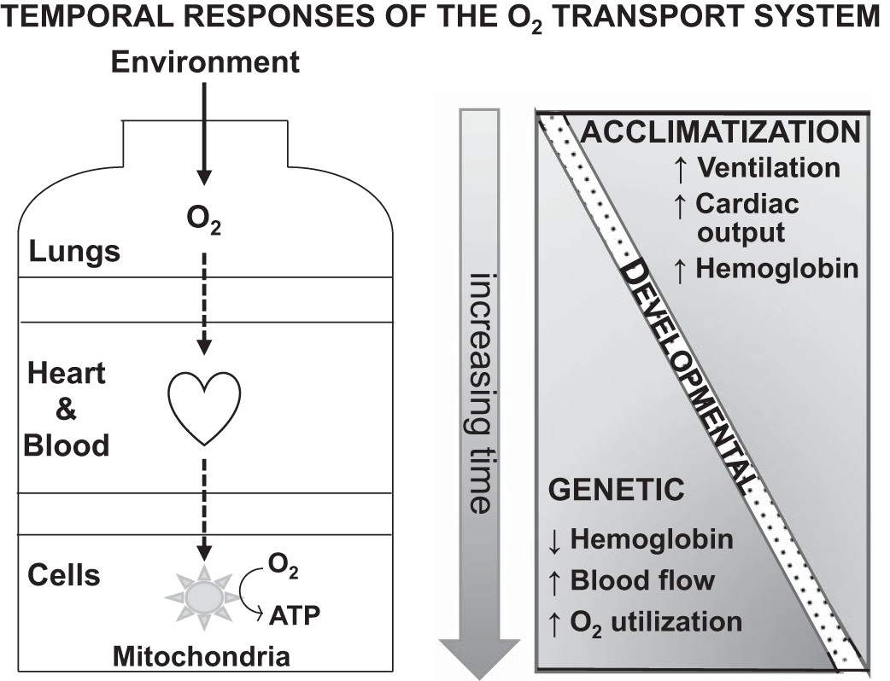
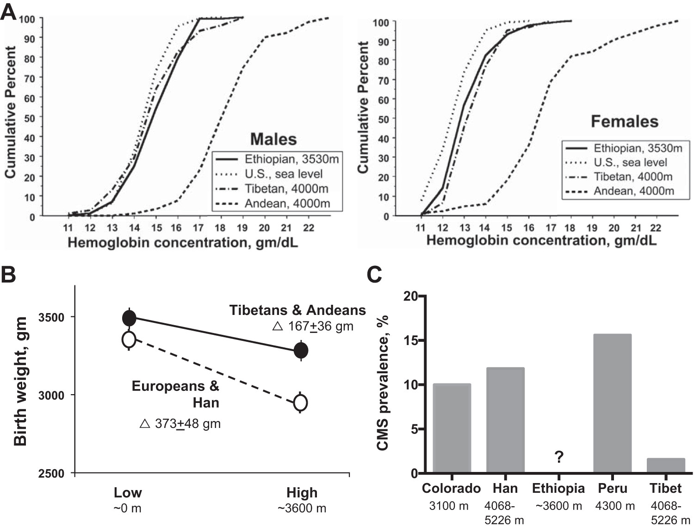

#import #biology #humans #blood #cells #mountain #tibet #andes #image

* Из **углеводов** можно получать до полутора раз больше АТФ, чем из жирных кислот или жиров, при том же количестве кислорода.
	* У **равнинных** жителей в горах обмен веществ смещается в сторону углеводов у мужчин, но не у женщин.
	* Мужчины коренных народов Тибета и Анд на уровне моря получают в **полтора раза** больше АТФ при том же количестве кислорода.
	* Преобладание углеводного обмена у них защищает **сердце** от гипоксии.
* У тибетцев меньше способность к окислению жирных кислот и выше производство **антиоксидантов** в скелетных мышцах.
	* Потребление **глюкозы** выше у мужчин коренных народов Тибета и Анд, а также беременных женщин коренных народов Анд.
	* Рост содержания **молочной кислоты** и жирных кислот на высоте может говорить о том, что усиливается окисление глюкозы и снижается - жирных кислот.
	* У жителей Тибета и Анд обмен **жирных кислот** протекает схожим образом.

# O2

> **Fig. 1**. The O2 transport system comprises two pumps, the lungs and the heart, that bring in O2 from the atmosphere and circulates it via the blood throughout the body, and two diffusion steps. The diffusion steps transfer O2 across the alveolar membrane and from the blood into tissues where it is consumed in the mitochondria to generate chemical energy in the form of adenosine triphosphate (ATP). Acclimatization involves changes in these components over days and developmental responses take place across lifetimes in chiefly the components affecting arterial O2 content. ==Long-term high-altitude populations are distinguished from acclimatized newcomers in terms of their hemoglobin levels, regional blood flow, and O2 utilization== components of the O2 transport system. [Moore (99)]

# Mitochondria

* O2 delivered to the tissue mitochondria fuels metabolism and the production of chemical energy or ATP (Fig. 1).
	* However, ATP can be produced from alternate fuel sources and pathways, with some being more efficient than others.
	* Specifically, ==utilization of carbohydrates (glucose, glycogen), rather than free fatty acids or lipids, can generate 25–50% more ATP per mole of O2 consumed== (59). [Сомеро_1988](2023-1230-1804.Сомеро_1988.md#Carbs%20and%20fats)
* A ==switch to carbohydrates== occurs after 3 wk of altitude acclimatization ==in males (19) but, interestingly, not females== (18).
	* Few studies have been performed in long-term high-altitude residents but those conducted also suggest a shift in fuel preference to carbohydrates.
	* Using positron-emission tomography (PET) to measure heart metabolism, Hochachka and coworkers (59) found that ==Quechua and Sherpa males after descent to sea level had a greater reliance on carbohydrate metabolism and a 50–60% gain in the production of ATP per mole of O2 consumption relative to lowlanders== (Table 1).
	* P magnetic resonance spectroscopy studies in these same Sherpa upon arrival and after 4 wk at low altitude also showed a ==preference for carbohydrate== that was maintained during acute hypoxia and moderate exercise ==in heart as well as chest wall skeletal muscle==.
	* The authors concluded that an increase in O2 efficiency represented a ==biochemical adaptation for defending against hypoxia in the hearts== of these two high-altitude groups (56).
	* A recent study by Horscroft and coworkers (60) has confirmed ==greater efficiency of O2 utilization, along with a lower capacity for fatty acid oxidation in skeletal muscle biopsies, and increased production of antioxidants== in direct measurements of Sherpa vs. acclimatized newcomer skeletal muscle (Table 1). 
* Glucose homeostasis is also altered at high altitude.
	* ==Glucose uptake and consequently lower venous glucose== levels have been observed in ==Andean, Tibetan==, and acclimatized-newcomer ==men (60, 157) as well as pregnant Andeans== (86).
	* This was interpreted as reflecting greater placenta uptake to spare O2 for fetal consumption (172) although other tissues may also be involved. [Beall_2007](2023-0918-1508.Beall_2007.md#Mitochondria)

# Genes

* Several studies have also shown functional associations with PPARA varian
	* Ge and coworkers (47) showed that ==serum lactate and free fatty acids rose== with increasing number of the naturally selected PPARA as well as EPAS1 alleles at 4,500 m, suggesting that selection may be acting to ==increase anaerobic glucose and decrease fatty acid metabolism==.
	* The greater efficiency of O2 utilization and ==increased production of antioxidants seen by Horscroft and coworkers (60) in Sherpa skeletal muscle== was related to the presence of selected-for PPARA alleles.
	* Of interest too is that ==fatty acid oxidation was identified as a pathway undergoing convergent evolution in Andeans and Himalayans== (42).

# Exercise

* There is a clear fall in maximal exercise performance or VO2max in acclimatized newcomers, amounting to a ~25% reduction at 3,000–4,000 m (45).
	* Independent of training effects, ==Tibetans and Andeans have less altitude-related fall than newcomers== (22, 25, 84, 159, 175), but VO2max has not been measured in Ethiopians.
	* Higher peak VO2 was related to ==lower hemoglobin levels== in Tibetans (and Han), suggesting that one factor benefiting Tibetans may be a ==lower blood viscosity and improved regional blood flow== (133).
	* Other factors could also be involved including a ==metabolic shift to carbohydrates, higher maximum heart rate==, smaller alveolararterial O2 gradients, ==greater tissue O2 extraction==, and less sympathetic or greater parasympathetic stimulation (22, 159).

# CMS

* Its prevalence varies by region (Fig. 2C), occurring in ~10% of ==Andean adult males over the age of 30 or postmenopausal females==, a similar frequency of high-altitude Coloradans, ~6% of Han migrants, but only ~1% of Tibetans (89, 102, 161).
	* To date, it has ==not been reported in Ethiopians== (10, 32) but no detailed epidemiological study has been conducted.

> **Fig. 2**. A: hemoglobin levels in Ethiopians and Tibetans are similar to those of US sea-level residents and below those seen Andean males or females at the altitudes shown [Beall et al. (10)]. Values among the high-altitude groups are, however, more similar if comparisons are made with acclimatized newcomers (see Table 2). B: Tibetans and Andeans have approximately half the altitude-associated reduction in infant birth weight compared with Europeans or Han Chinese. C: prevalence of chronic mountain sickness (CMS) is markedly less in Tibetans than similarly aged men from various ancestry groups residing at the altitudes shown. [Niermeyer et al. (110)] [Hainsworth_2007](2023-0926-0928.Hainsworth_2007.md)

---
Moore 2017. Measuring high-altitude adaptation. [WEB](https://doi.org/10.1152/japplphysiol.00321.2017), [PDF](../source/Moore_2017.pdf)