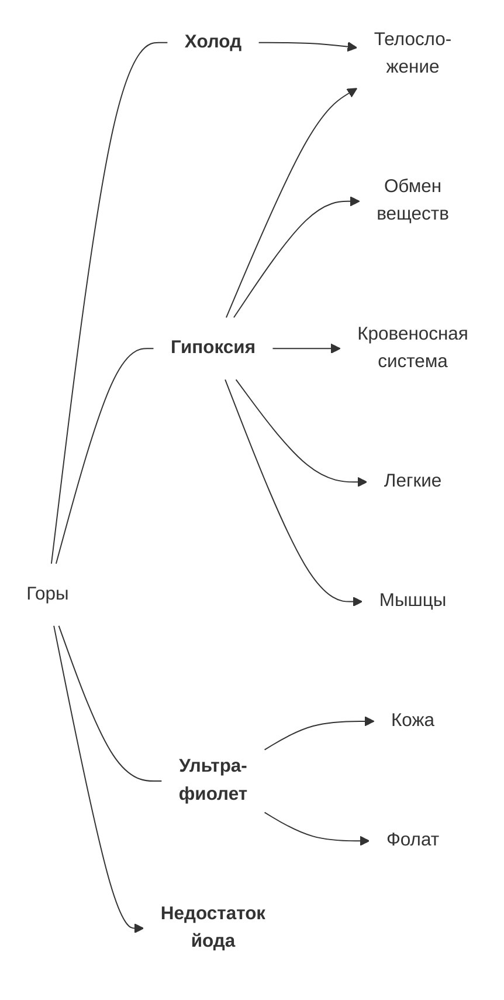

#biology #humans #mountain

* [Адаптивные типы человека](2023-0530-1523.Адаптивные%20типы%20человека.md)
* [Адаптации к гипоксии](2023-0416-2200.Адаптации%20к%20гипоксии.md)
* [Защита от ультрафиолета](2023-0912-1519.Защита%20от%20ультрафиолета.md)
* [Соль и йод](2024-0213-1659.Соль%20и%20йод.md)